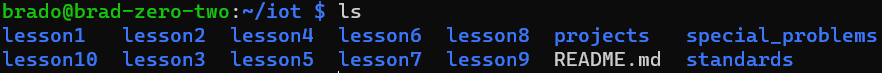

# Lab 1 - Exploring the Command Line
## Example Commands
* `hostname`
    * prints the name of the device that will be reported to the netowrk's dns server
    * 
* `env`
    * prints currenly registered environment variables
    * 
* `ps`
    * prints currently running process (note: generally more useful with `-aux` flags)
    * 
* `pwd`
    * prints the current absolute working directory of the current command line isntance
    * 
* `git clone https://github.com/kevinwlu/iot.git`
    * downloads the repository `https://github.com/kevinwlu/iot.git` into a folder named after the repository name (iot in this case) and initializes it for use with git
    * 
* `cd iot`
    * changes the working dirctory (folder) that you are in to the given folder (in this case iot); No output is printed
    * 
* `ls`
    * prints files in the current working directory
    * 
* `cd`
    * changes working directory; when used with no parameters it changes to the parent directory
    * 
* `df`
    * prints current disk usage separated by partition
    * 
* `mkdir demo`
    * makes a new directory with the name given (demo in this case); has no output
    * 
* `cd demo`
    * see above `cd`
    * 
* `nano file`
    * opens "file" in the nano command line text editor; use `ctrl`+`x` to exit and you will be asked to save
    * 
* `cat file`
    * prints the contents of "file" assuming current console text encoding
    * 
* `cp file file1`
    * creates a copy of "file" at location "file1"
    * 
* `mv file file2`
    * renames "file" to "file2" (if "file2" location is on same drive as "file") or copies "file" to location "file2" and then deletes "file" (if files are on different drives)
    * 
* `rm file2`
    * deletes "file2" (does not use a "recylcing bin")
    * 
* `clear`
    * clears output from the console's screen and sets up a new line at the top, history is still preserved
    * 
* `man uname`
    * shows the manual page for the package "uname", uses the same controls/keyboard shortcuts as [`less`](https://www.man7.org/linux/man-pages/man1/less.1.html#COMMANDS)
    * 
* `uname -a`
    * prints information obout the kernel, hostname, build date, arch, and operating system
    * 
* `ifconfig`
    * shows all interfaces, their settings, and their connection status
    * [as noted by the linux foundation](https://wiki.linuxfoundation.org/networking/net-tools), `ifconfig` is obsolete in favor of `ip addr` (aliases `ip a` and `ip address`)
    * 
* `ip a`
    * current replacement for `ifconfig`
    * 
* `ping localhost`
    * sends a "ping" to the address specified (localhost in this case); used to determine if a host is resolvable and online (does not determine if ports are open)
    * 
* `nestat`
    * shows network configuration of device (e.g. listening ports, requesting ports, services, etc.)
    * 

## Commands I Find Useful

* `dotnet`
    * used for making and managing dotnet (C#, F#, and Visual Basic) projects
    * Example using the command: [Discord Bot Application](https://github.com/StevensIEEE/DiscordBotExampleCSharpRemora)
* `rsync`
    * used for syncing files between systems
    * using with `-avhzd` is good for archivingin and monitoring the process, along with `--delete-excluded` and `--exclude <pattern>` to remove any files that were deleted from the source and any files you don't want archived
* `systemctl`
    * for making and managing services that can be long running, running at startup, and automatically restarting
* `ffmpeg`
    * used for processing images and videos (e.g. transcoding, filtering, etc.)