# Lab 03 Exploring Python
## Creating a virtual environment
For this Lab, I created a python virutal environment, this will prevent any errant global packages from messing up work specifically for this lab
1. To install the virtual environment package on Debian/Ubuntu you must use apt, `sudo apt install python3-venv`
2. The command `python3 -m venv .venv` will create a virtual environment in the source folder `.venv`
    * Output should looks as shown, I circled the folder created by the command 
    * 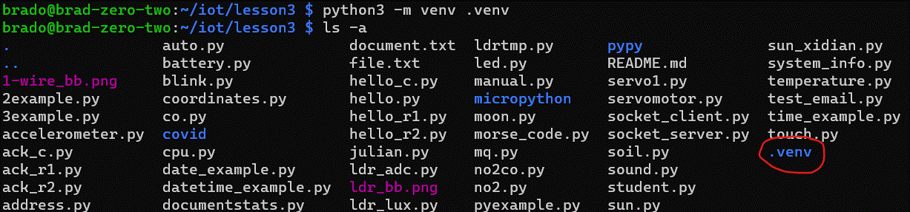
3. Activate the virtual environment with `source .venv/bin/activate` if on bash, for other command lines use the following chart from [python's venv documentation](https://docs.python.org/3/library/venv.html)
    * 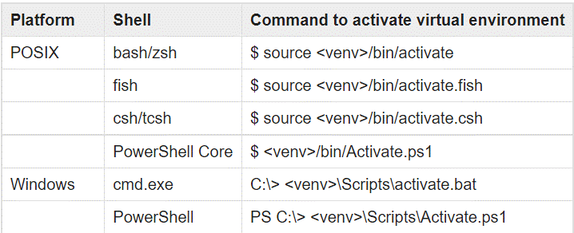
    * Terminal should look as shown:
    * 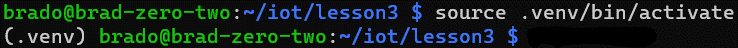
## Installing Required Packages
1. Install required packages using `pip install`
    1. `pip install jdcal`
    2. `pip install astral`
    3. `pip install geopy`
    4. `pip install psutil`
    * 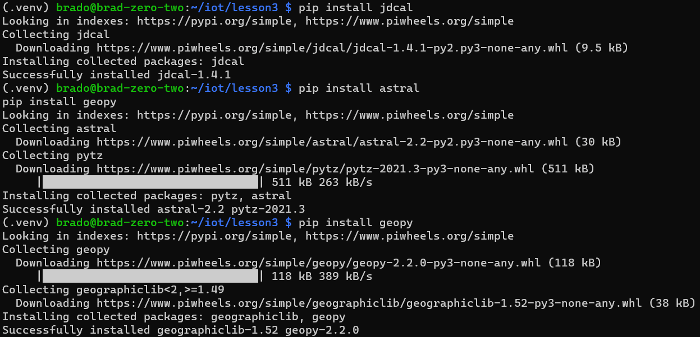
2. Check packages installed and their versions using `pip freeze`
    * 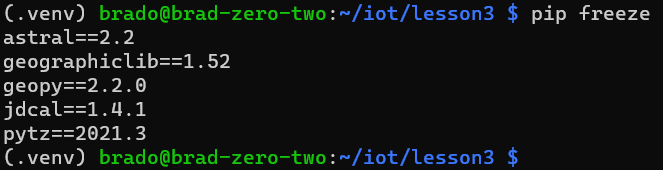

## Running Examples
1. `python3 julian.py`
    * Prints the Calendar date, Julian Date, and Modified Julian Date
    * 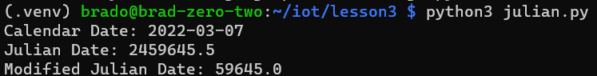
2. `python date_example.py`
    * Prints the date in different formats, day of the week, month name, year, and how long until the start and end of classes
    * 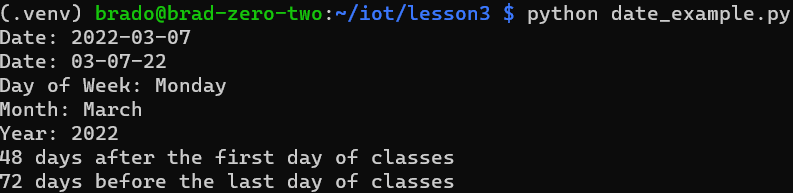
3. `python datetime_example.py`
    * prints the date and time in different formats using the `datetime` and `time` python modules
    * 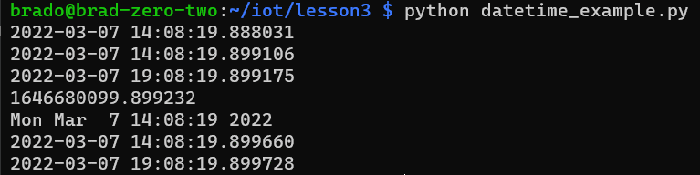
4. `python time_example.py`
    * Prints the datetime every 10 seconds using the `time` module; use `ctrl`+`c` to cancel
    * 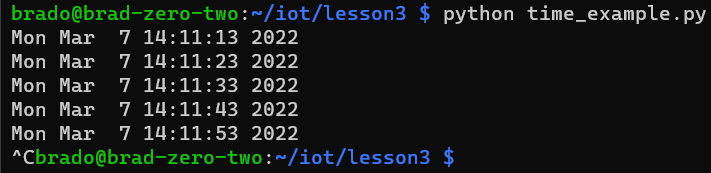
5. `python sun.py`
    * Prints information about the time of day the sun will be at specific locations in the sky based on the given location
    * 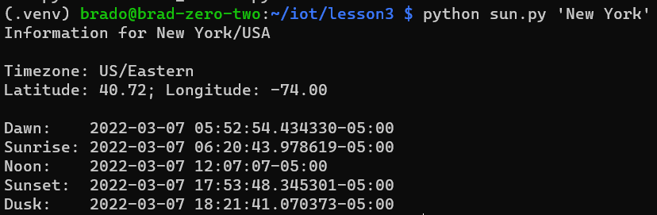
6. `python moon.py`
    * Prints the current phase of the moon based on the day along with the phases for the next lunar month
    * 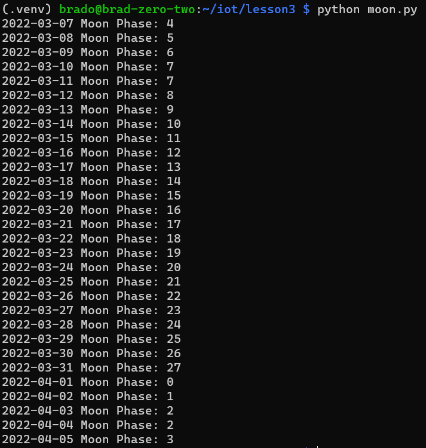
7. `python coordinates.py`
    * Prints latitude and longitude from string based location
    * 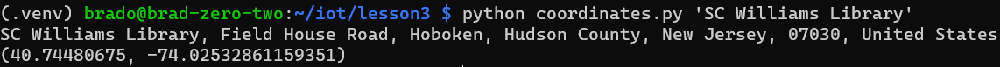
8. `python address.py`
    * Prints address based on latitude and longitude
    * 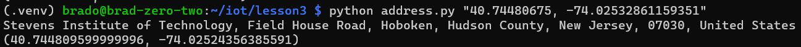
9. `python cpu.py`
    * Prints CPU info and utilization
    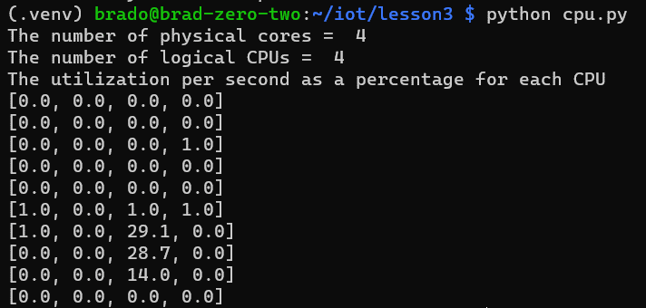
10. `python battery.py`
    * (Should) Print external battery info (I don't have one attached)
    * 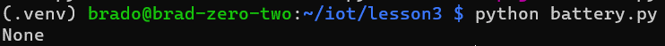
11. `python system_info.py`
    * first run `sed --in-place --follow-symlinks "s|/opt/vc/bin/vcgencmd|$(which vcgencmd)|" system_info.py` to enter your location of vcgencmd
    * prints free ram, number of process running, up time, number of remote connections, cpu temp, ip address, and cpu speed
    * 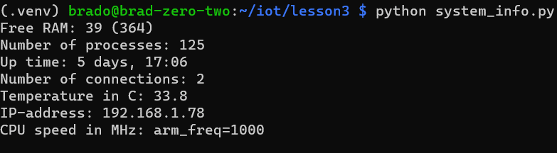
12. `python documentstats.py document.txt`
    * prints the 10 most used words in a document and how often each was used
    * 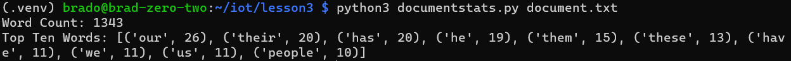
13. Sockets
    * run `screen`, this will allow you to splitscreen your ssh
        * (install with `sudo apt install screen` if you dont have it)
        * will have to press enter once on first run to get in terminal
        * you must re-run `source .venv/bin/activate` on each terminal if using virtualenv
    *  `ctrl-a` `S`, `ctrl-a` `tab`, `ctrl-a` `c`
        * split, switch, new terminal
    * switch back and forth with `ctrl-a` `tab`
    * run `python socket_server.py` and `python socket_client.py locahost` in separate windows
    * 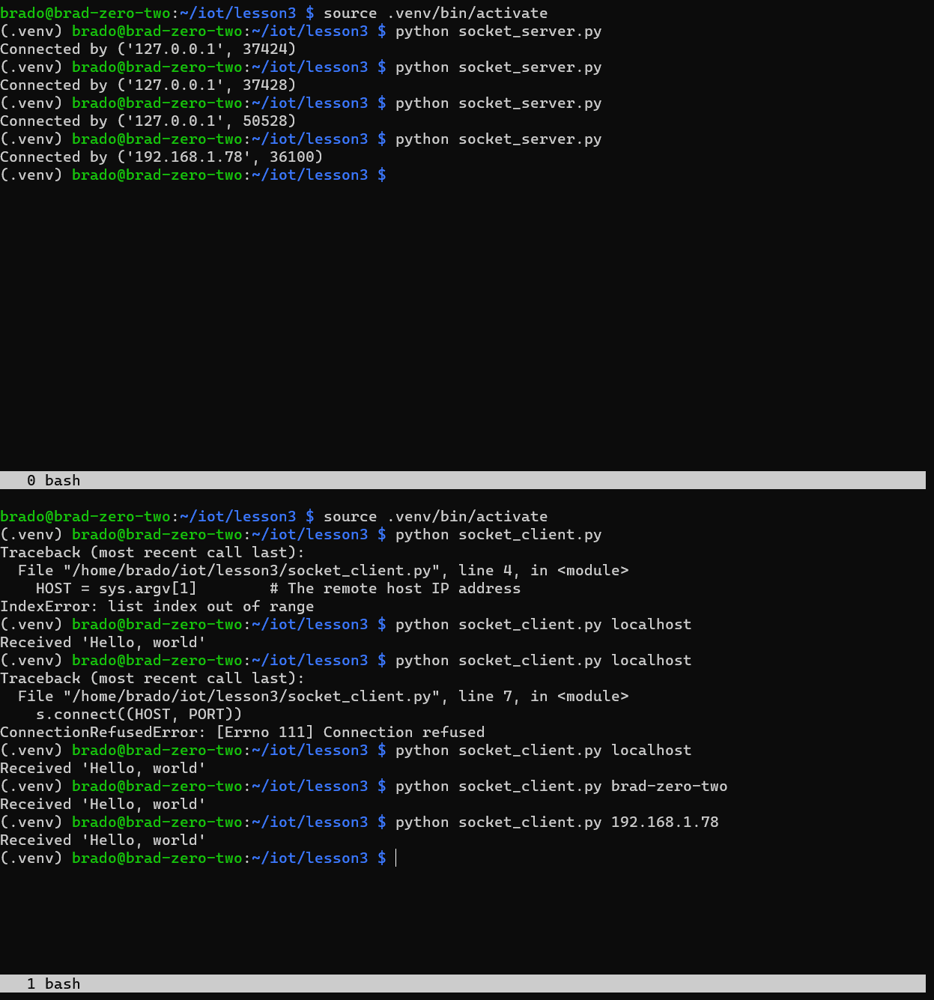