# Lab 04 Django and Flask
## Changes for Arch Linux
* Note: if you are using something other than `pacman` (e.g. `yay`)
* Installing MariaDB
    * [Source](https://www.vultr.com/docs/how-to-install-mariadb-10-3-or-mysql-8-0-on-arch-linux/)
    * Install `mariadb-server` using `sudo pacman -S mariadb`
        * `mariadb-clients` is a dependancy of this package therefore will not need to be manually installed, however if not manually installed it will be removed whenever `mariadb` is removed
    * run `sudo mysql_install_db --user=mysql --basedir=/usr --datadir=/var/lib/mysql`
        * Output will looks as follows:
        * 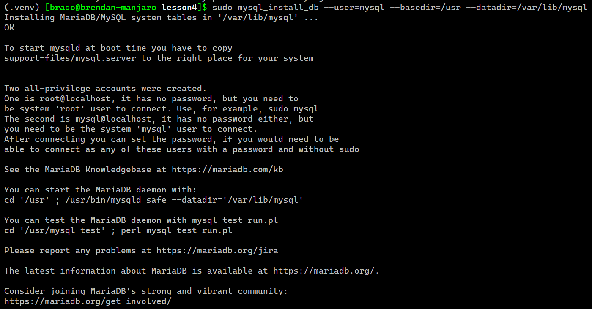
    * run `sudo systemctl enable --now mariadb`
        * If `mariadb` is not running you will get the error `ERROR 2002 (HY000): Can't connect to local server through socket '/run/mysqld/mysqld.sock'`
        * this command will start the process and set it to automatically start alongside the computer
* Install `python-mysqldb` using `sudo pacman -S python-mysqlclient`
## Stevens Folder Project
* `django-admin startproject stevens`
    * Creates a new folder named "stevens" and adds the necessary files for a template django project
    * 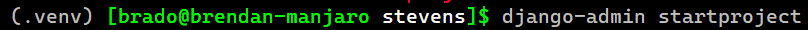
    * 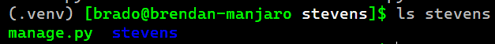


### Script
##### (Copy pasting into the command line will not work, make a file or copy individual lines)
```bash
set -ex
python -m venv .venv
source .venv/bin/activate
pip install -U setuptools django djangorestframework django-filter markdown requests
sudo apt install mariadb-server mariadb-client python3-mysqldb
pip install -U mysqlclient
# sudo mysql_secure_installation\
read -p "Press Enter run Stevens Project"
django-admin startproject stevens
pushd stevens
python3 manage.py startapp myapp
echo "enter the repo code in this database terminal"
sudo mysql -u root -p
vim settings.py #replace with sed
#update ../urls.py to have djangoproject 4.0 url
ln -sf ../../urls.py .
pushd ../myapp
ln -sf ../../admin.py ../../models.py ../../views.py .
mkdir -p static/myapp templates/myapp
pushd templates/myapp
ln -s ../../../index.html .
vim templates/myapp/index.html #replace with sed asking api key
pushd ../../static/myapp
ln -s ../../../../../static/favicon.ico .
ln -s ../../../../../static/*.css ../../../../../static/*.js .
read -p "Press Enter to do first time stuff"
cd ..
python3 manage.py makemigrations myapp
python3 manage.py migrate
python3 manage.py createsuperuser
python manage.py runserver 0.0.0.0:8000
```
### Site Config
Create an entry at http://site-ip:port/admin
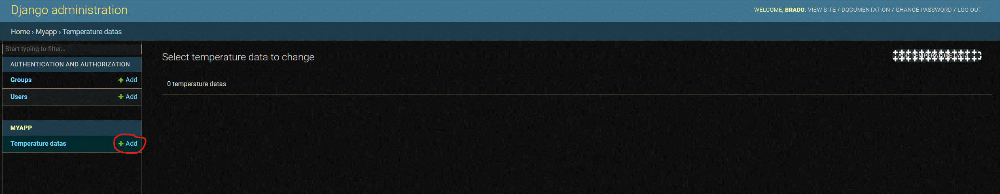
Enter time (YYYY-MM-DD HH:MM:SS Format), temperature, and location data and save
###### (Location blurred for privacy)
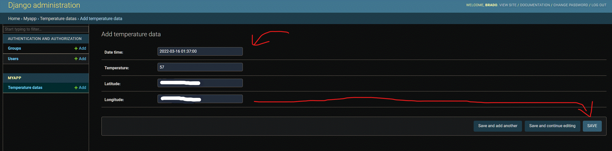
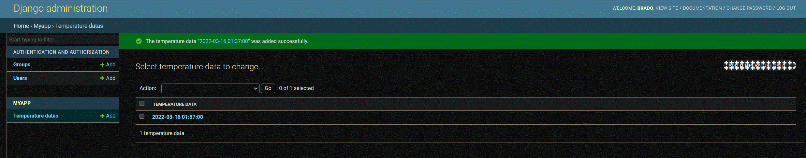
View site at http://site-ip:port
###### (Map Blurred for Privacy)
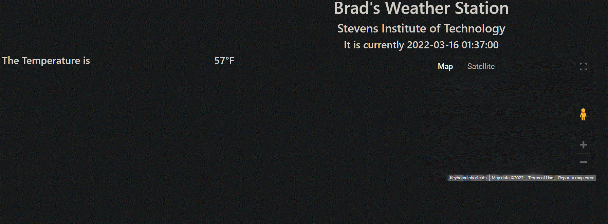

## MyCPU Project
### Script
```bash
set -mex
django-admin startproject mycpu
pushd mycpu
python manage.py startapp myapp
pushd mycpu
sed --in-place=.bak -e "/^\s*INSTALLED_APPS =.*/a \ \ \ \ \'myapp\'\,\n    \'rest_framework\'," -e "s/ALLOWED_HOSTS =.*/ALLOWED_HOSTS = ['*']/" settings.py
popd
popd
# in iot/mycpu -> iot/mycpu/mycpu/mycpu
ln -sfr urls.py mycpu/mycpu
ln -sfr admin.py models.py views.py serializers.py mycpu/myapp
# Change admin password after 'createsuperuser'
pushd mycpu
pushd myapp
mkdir -p static/myapp templates/myapp
ln -sfr ../../index.html templates/myapp
read -p "Enter Google Maps API Key: " api_key
sed --in-place --follow-symlinks "s/YOUR_API_KEY/$api_key/" tmeplates/myapp/index.html
ln -sfr ../../../static/favicon.ico ../../../static/*.css ../../../static/*.js static/myapp
popd
ln -sfr ../controller.py .
# Change admin password after 'createsuperuser'
pip install -U psutil urllib3
python manage.py makemigrations myapp
python manage.py migrate
python manage.py createsuperuser
read -p "Enter the username you just entered above: " user
read -sp "Enter the password you just entered above: " pass
sed --in-place=.bak --follow-symlinks "s/auth=('admin', 'admin')/auth=('$user', '$pass')/" myapp/views.py
sed --in-place=.bak --follow-symlinks "s/auth=('admin', 'admin')/auth=('$user', '$pass')/" controller.py
python manage.py runserver 0.0.0.0:8000 &
sleep 5
read -p "Enter Location in /admin"
read -p "Open Routes /dt /cpu /mem"
curl -X POST -F "name=2022" http://localhost:8000/dt/
curl -X POST -F "name=20" http://localhost:8000/cpu/
curl -X POST -F "name=20" http://localhost:8000/mem/
python controller.py &
```
### In Gui
Load http://site-ip:port/admin
Login
Add Location Data
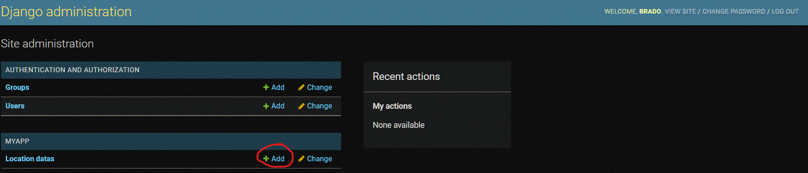
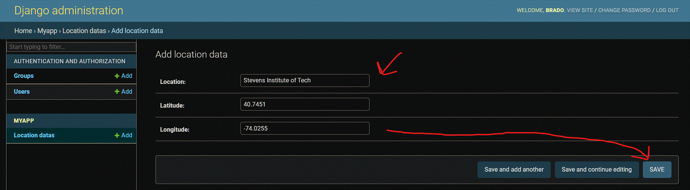
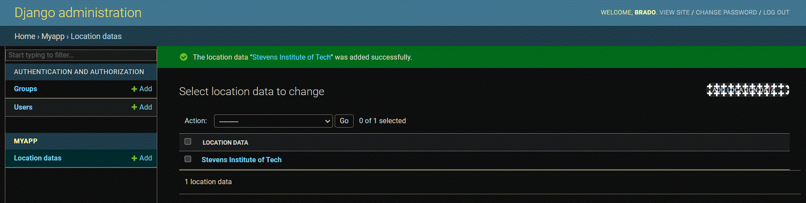
##### Script will handle dt, cpu, and mem for you if you just press enter, but not location
Go to http://site-ip:port/dt
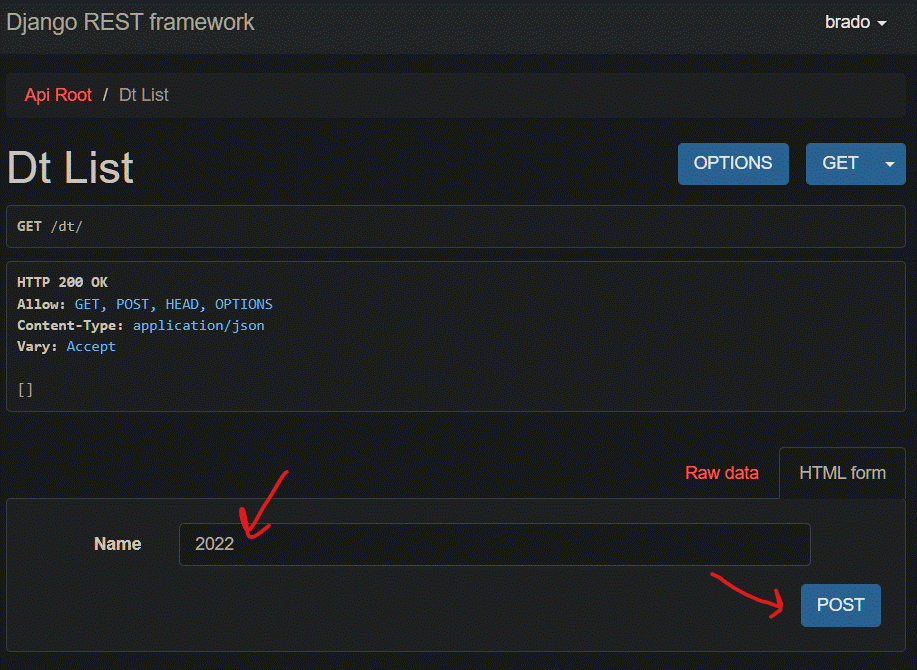
Go to http://site-ip:port/cpu
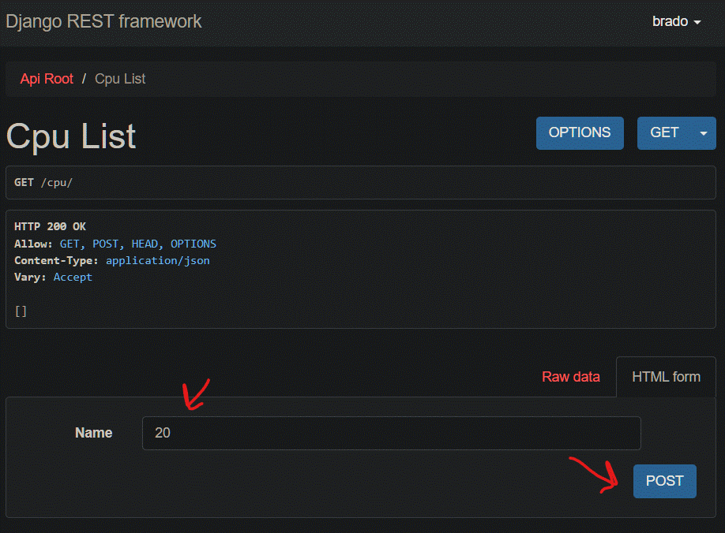
Go to http://site-ip:port/mem
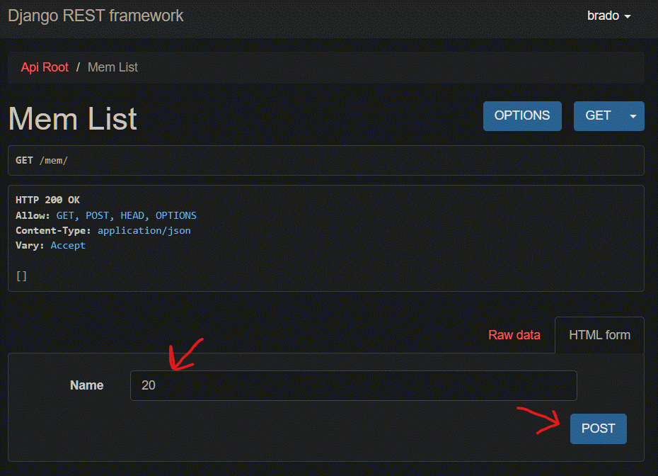
Go to http://site-ip:port/home
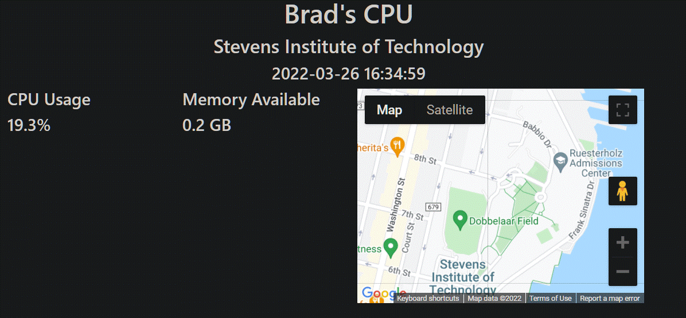
With `python controller.py` running this will update automatically

