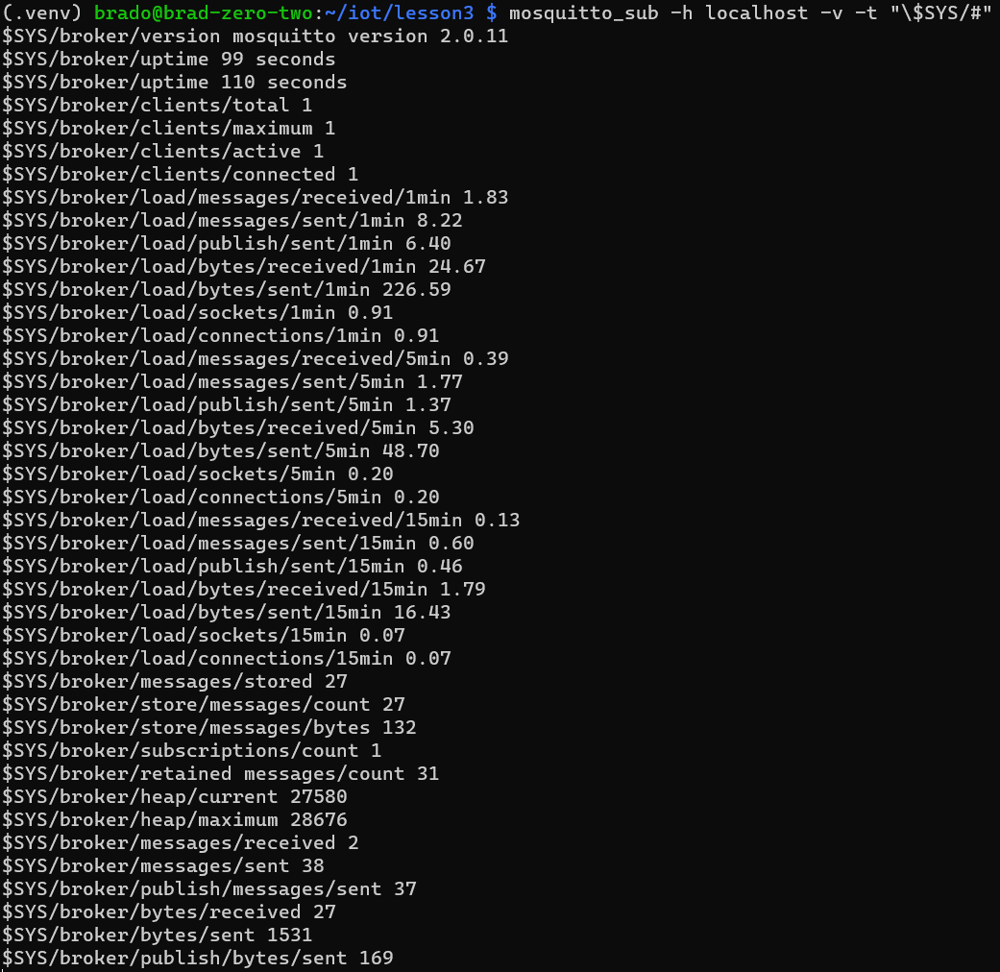

# Lab 05 Crossbar.io and Paho MQTT
* Install packages `mosquitto` and `mosquitto-clients`
* Run `mosquitto_sub -h localhost -v -t "\$SYS/#"`
* 
* `service mosquitto status` (alias to `systemctl status mosquitto`)
* 
* 
* Netstat shows listening on port 1883, meaning the MQTT is listening on that port for unencrypted TCP connections (encrypted would be 8883)
* use tmux to split terminal
* run `mosquitto_sub -h localhost -v -t test/topic` in one and `mosquitto_pub -h localhost -t test/topic -m "message-$(date)"` in another
    * Change `message-$(date)` to publish whatever you want

* Commands to run
```bash
sudo apt update
sudo apt install -y mosquitto mosquitto-clients tmux
tmux
tmux split-window -h
mosquitto_sub -h localhost -v -t test/topic &
tmux last-pane
mosquitto_pub -h localhost -t test/topic -m "message-$(date)"
```
* Script to Run
```bash
tmux new -s '2x1 panes' 'mosquitto_sub -h localhost -v -t test/topic' \; set-option -g remain-on-exit on \; split-window 'mosquitto_pub -h localhost -t test/topic -m "message-$(date)"; bash;' \; send-keys 'mosquitto_pub -h localhost -t test/topic -m "message-$(date)' \; attach
```
* Quit tmux with `ctrl`+`b`
* The top terminal is the subscribe, the bottom terminal is the publish
## Paho

Commands to run
```bash
python3 -m venv .venv-lesson05
tmux
source .venv-lesson05/bin/activate
pip3 install -U paho-mqtt psutil
git clone https://github.com/eclipse/paho.mqtt.python.git
python client.py
# Use the keys here
Ctrl+b
%
# Ok back to shell commands
source .venv-lesson05/bin/activate
python sub.py
python client.py
# Use the keys here
Ctrl+b
o
Ctrl+c
# Ok back to shell commands
python pub.py
# Use Keys
Ctrl-b
o
Ctrl-c
# Shell
python sub-multiple.py
# Use Keys
Ctrl-b
o
#Shell
python pub-multiple.py
# Use Keys
Ctrl-b
o
Ctrl-c
# Shell
python subcpu.py
# Use Keys
Ctrl-b
o
#Shell
python pubcpu.py
```
Next Section
```bash
vcgencmdloc=$(which vcgencmd)
sed --in-place=.bak --follow-symlinks "s|/opt/vc/bin/vcgencmd|$vcgencmdloc|" system_info.py
python subraspi.py
python pubraspi.py
```
