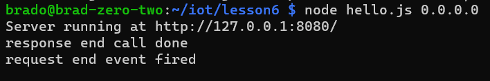
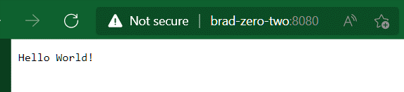
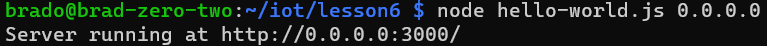
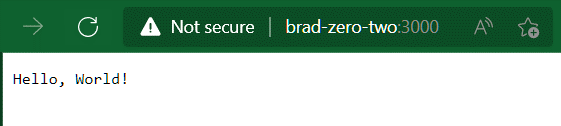
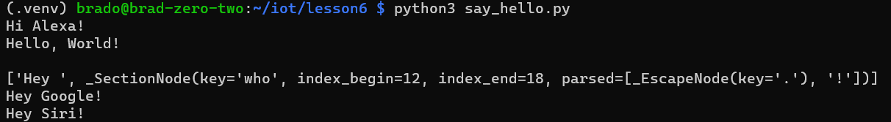

# Lab 06: Nodejs
## Setup
Note: Before running check [this repo](https://github.com/nvm-sh/nvm?msclkid=ea440f8bc42711ec8c687a0b2e5f0eb3#installing-and-updating) for the most recent version of nvm, replace the url below (up to date as of April 24th 2022, last update of repo December 2021) with the one specified or use https://raw.githubusercontent.com/nvm-sh/nvm/master/install.sh doe the latest, untested version
```bash
curl -o- https://raw.githubusercontent.com/nvm-sh/nvm/v0.39.1/install.sh | bash
```
now reload the shell or enter the commands shown on screen
```bash
nvm install node #node is an alias for the latest version, can also use "lts/*" for the latest LTS release or "Gallium" for latest 16.x.x (the current LTS release)
nvm use default
sed --in-place=.bak --follow-symlinks "s/const hostname = '127.0.0.1'/const hostname = process.argv[2] || \'127.0.0.1\'/gI" hello-world.js #Allows you to specify host address (i.e., 0.0.0.0 for all ipv4 addresses)
node hello-world.js 0.0.0.0 #0.0.0.0 means that you listen on all interfaces (i.e., wifi interface, wired interface, local interface, and any vpn/virtual interfaces)
#open this in browser then use ctrl-c, use your raspberry pi's ip address or hostname
sed --in-place=.bak --follow-symlinks "s/.listen(8080)/.listen(8080, process.argv[2] || '127.0.0.1')/" hello.js
node hello.js 0.0.0.0
#open this in browser then use ctrl-c
sed --in-place=.bak --follow-symlinks "s/.listen(8080)/.listen(8080, process.argv[2] || '127.0.0.1')/" http.js
node http.js 0.0.0.0
#open this in browser then use ctrl-c
python -m venv .venv
source .venv/bin/activate
pip install pystache
cat say_hello.mustache 
cat say_hello.py
python3 say_hello.py
```






