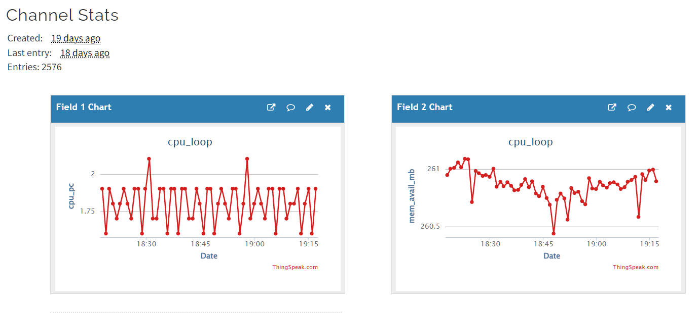
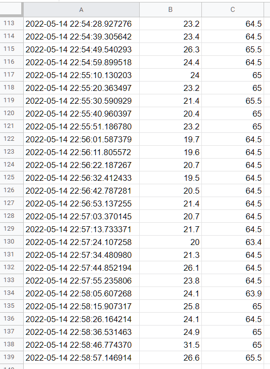

# Lab 07 Cloud IoT
## ThingSpeak
* Follow main github steps to create thingspeak account and channel
```bash
python -m venv .venv
source .venv/bin/activate
pip install psutil
mkdir demo
cd demo
ln -s ../thuingspeak_cpu_loop.py ../thingspeak_feed.py .
python thingspeak_feed.py
```

## Google Sheets
* Follow main git repo instructions to setup google cloud service account and spreadsheet file
```bash
source .venv/bin/activate
pip3 install -U gspread oauth2client
cd demo ../rpi_spreadsheet.py ../../lesson3/system_info.py .
read -p "Enter the credential file name: " filename
sed --in-place=.bak --follow-symlinks "s/KEY_FILE_NAME.json/$filename/" rpi_spreadsheet.py
read -p "Enter the sheet name: " sheetname
sed --in-place=.bak --follow-symlinks "s/SPREADSHEET_NAME/$sheetname/" rpi_spreadsheet.py
python rpi_spreadsheet.py
```
